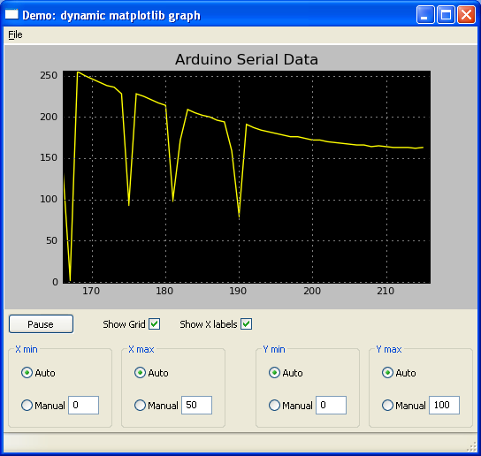

# Arduino Plot

Python script to plot a numeric data received from a serial port in real time.



## How to run

To use, simply run command below in the command line providing serial port to be used and optionally port baud rate and timeout values. 

````bash
$ ./wx_mpl_dynamic_graph.py [-h] [-b BAUDRATE] [-t TIMEOUT] port
````

For instance, to receive data from `com4` port with baud rate equal to 9600 run

````bash
$ ./wx_mpl_dynamic_graph.py com4 --baudrate 9600
```` 

To display help menu run the command below.
````bash
$ ./wx_mpl_dynamic_graph.py --help
```` 

**Note:** Make sure you have your Arduino IDE closed, or it will block other programs like this one from using the serial port.

## Requirements

Install required [`wxPython Project Phoenix`](https://github.com/wxWidgets/Phoenix) system dependencies and than Python packages from `requirements.txt` file:

````bash
$ pip install -r requirements.txt
````